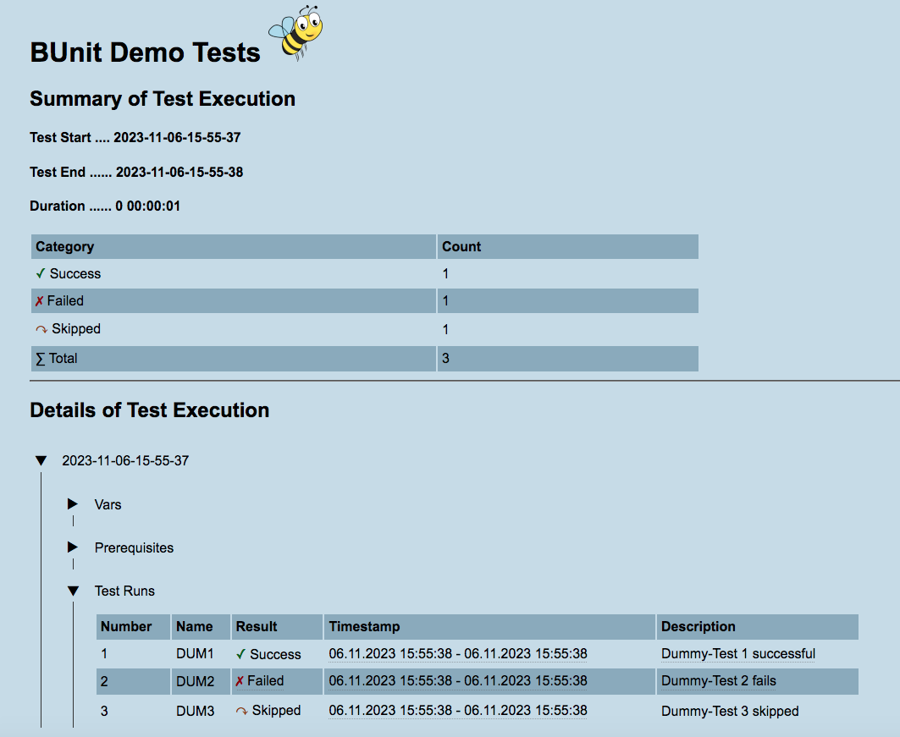
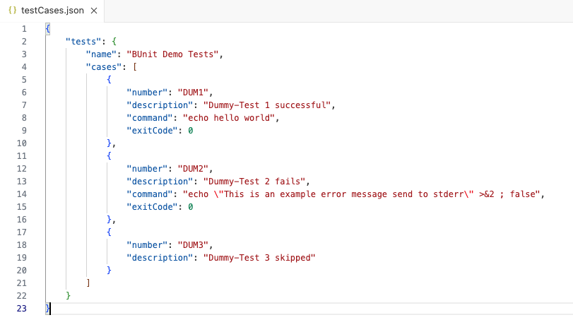
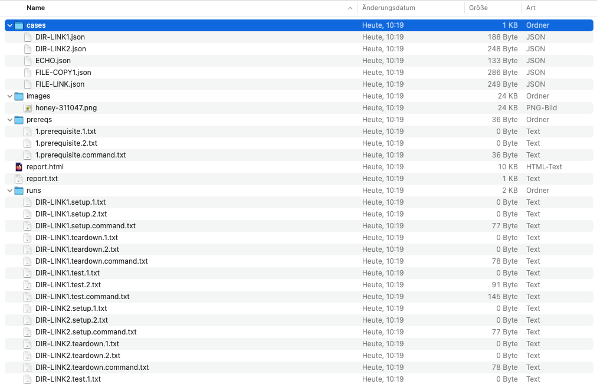
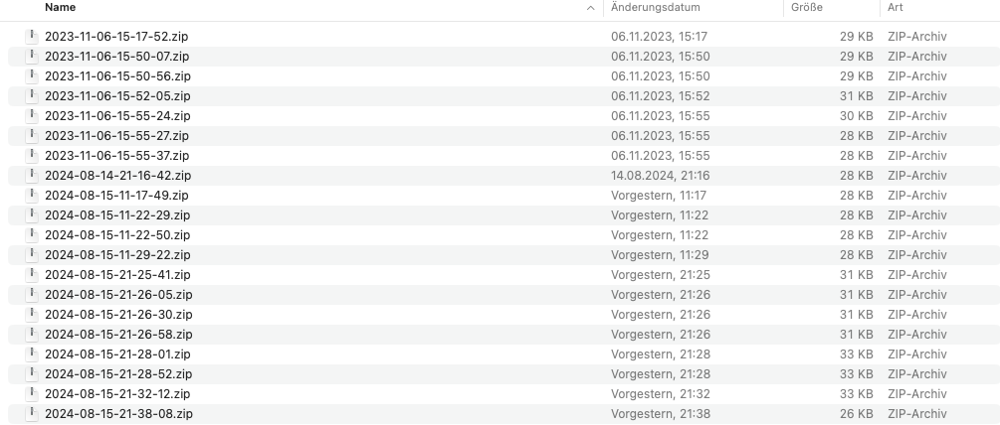
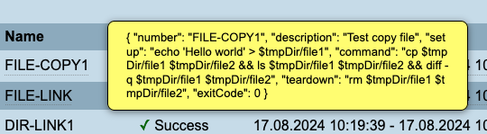
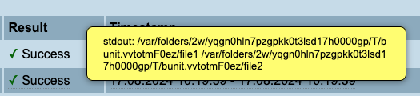
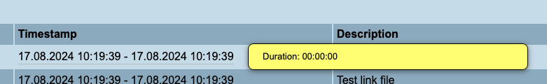
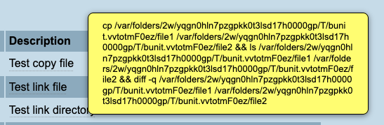

# BUnit 

## What is BUnit?

BUnit (spoken bee unit) is a test framework that runs bash test cases. With BUnit you can create and run test cases that are based on execution of bash commands and bash scripts.

BUnit is powerful when defining your test cases:

1. variables can be used in your test commands
1. prerequisites can be defined that should be executed or checked before your test cases are executed
1. tests are defined using bash commands, their expected exit code and error patterns to be checked
1. setup and teardown commands can be defined to be executed individually before and after every test case

## Getting started

In order to run BUnit test cases you must meet the following requirements

1. a Unix environment with a bash shell is available
1. the utility **jq** has been downloaded and added to your path

1\. for test execution a Unix environment with bash is required. You can use Cygwin, Git-Bash or similar programs if you are on Windows.

2\. the Json parser **jq** is required. You can download it from [here](https://stedolan.github.io/jq/).

Lets have a look to a little example. Execution of BUnit tests is controlled by a shell script that is the center brick of the BUnit framework: runTest.sh

Two more files are required

- testCases.json
- template.report.html

testCases.json is a Json file that is used to define variables, prerequisites and test cases.

template.report.html is an HTML template used to generate a report when testing. We will come back to the template file soon.

The test definition file has a name followed by our first test cases:

```json
{
	"tests": {
		"name": "BUnit Demo Tests",
		"cases": [
			{
				"number": "DUM1",
				"description": "Dummy-Test 1 successful",
				"command": "echo hello world",
				"exitCode": 0
			},
			{
				"number": "DUM2",
				"description": "Dummy-Test 2 fails",
				"command": "echo \"This is an example error message send to stderr\" >&2 ; false",
				"exitCode": 0
			},
			{
				"number": "DUM3",
				"description": "Dummy-Test 3 skipped"
			}
		]
	}
}
```


As you can see a test case is identified by a unique number followed by a description.

After that a command is given that will be executed when you run your tests. And finally an expected exit code is provided that will be checked by BUnit after execution of the test command.

Test case number one called DUM1 is a simple echo command that should work without any errors. So the expected exit code should be 0 and this test case should succeed.

Test case number two, DUM2, is expected to fail. While the two commands "echo" and "false" will give an exit code of 1 this will not match against the expected exit code 0. Thus this test will fail when executed.

The last test case DUM3 demonstrate how to skip a test case. If no command is given BUnit will skip it and do nothing with it.

Ok, lets run our test cases now. Simply execute the BUnit run script (with file option -f) and watch the console output.

```bash
$ ./runTest.sh -f testCases.json
Date of Test Run:  2023-11-06-15-55-37
_____________________________________________________________________________________________________________________
_____________________________________________________________________________________________________________________
TestCase[1]       : DUM1    Success [06.11.2023 15:55:38 - 06.11.2023 15:55:38] Dummy-Test 1 successful
TestCase[2]       : DUM2    Failed  [06.11.2023 15:55:38 - 06.11.2023 15:55:38] Dummy-Test 2 fails
TestCase[3]       : DUM3    Skipped [06.11.2023 15:55:38 - 06.11.2023 15:55:38] Dummy-Test 3 skipped
_____________________________________________________________________________________________________________________
Test Summary
Skipped tests = 1
Failed tests = 1
Successful tests = 1
------------------------------------
Total tests = 3

Start Time ... 2023-11-06-15-55-37
End Time ..... 2023-11-06-15-55-38
Duration ..... 0 00:00:01
```

As expected we see that three test cases were executed. The first one was successful, the second one failed and the last one was skipped.

The test results are written to a newly created directory into two files "report.txt" and "report.html". The file "report.txt" contains the console output you already saw during execution. The results can also viewed in a more user friendly appearance. Open your favourite browser and navigate to the file report.html in subdirectory reports/latest. It should look like this:



## Json Format

Test case are defined using a Json file. Open the file testCases.json with your preferred editor:



The structure of the JSON file is kept simple. The root node is called "tests". It contains subnodes "name", "vars", "prerequisites" and "cases".

"name" can be used to give a name to the test suite. It is used as a heading in the HTML report.

We will come back to "vars" and "prerequisites" later, but first we will look at the test cases defined under "cases".

### Test Cases

A test case is defined with a number, a description, a test command and an expectation. For example, the first test case "Dummy test 1" has the number "DUM1". The command specified under "command" is executed when the test is started and contains the test command. The expected "exitCode" in this example is 0.

```json
{
    "number": "DUM1",
    "description": "Dummy-Test 1 successful",
    "command": "echo hello world",
    "exitCode": 0
}
```

A complete test case can use further attributes. With "setup" you can define a single or even several commands that should be executed before the actual test is run. With "teardown" you can specify a sequence of commands that should be executed after the test run.

```json
{
	"number": "FILE-COPY",
	"description": "Test copy file",
	"setup": "echo 'Hello world' > file1",
	"command": "cp file1 file2 && ls file1 file2 && diff -q file1 file2",
	"teardown": "rm file1 file2",
	"exitCode": 0
}
```

The test case ""FILE-COPY" tests the Linux file copy command. The source file is created before the test is run by the setup command. After the test run and a diff is done in order to check the result the test files are removed by the teardown command.

There are test cases where a failing command is expected (negative test cases). Such cases can be written using the expectation exitCode=1.

```json
{
	"number": "DIR-LINK",
	"description": "Test link directory",
	"setup": "mkdir dir1",
	"command": "ln dir1 dir2",
	"teardown": "rm -rf dir1",
	"exitCode": 1
}
```

Linking directories is not allowed under Linux and leads to exit code 1. When this test is run by BUnit it will succeed as the expected error code 1 will be returned from the "ln" command.

Expectations can be detailed using a pattern to check the output of the test. For a positive test with exit code 0 the pattern is checked against stdout.

```json
{
	"number": "ECHO",
	"description": "Test echo command",
	"command": "echo hello world",
	"exitCode": 0,
	"outputPattern": "hello .*d"
}
```

This example shows how to use exitcode and outputPattern to compare the result using regular expressions.

For negative test cases the outputPattern is compared against stderr instead of stdout. This allows testing of correct error message from a command.

```json
{
	"number": "DIR-LINK2",
	"description": "Test link directory and verify error message",
	"setup": "mkdir dir1",
	"command": "ln dir1 dir2",
	"teardown": "rm -rf dir1",
	"exitCode": 1,
	"outputPattern": "Is a directory"
}
```

### Variables

Any number of variables can be defined in a test file. This makes the test cases more flexible when changes are made to the test environment. In this case, a value for a variable can be changed centrally without having to maintain many test cases individually.

Variables are defined in the "vars" section with name and value:

```json
{
    ...
    "vars": [
        {
            "name": "tempdir",
            "value": "temp"
        },
        {
            "name": "file1",
            "value": "the-source-file.txt"
        },
        {
            "name": "file2",
            "value": "the-target-file.txt"
        }
    ]
}
```

**How to use variables?**

Variables are published to the Bash environment when the test script is run, using the syntax for Bash variables preceded by $.

```json
{
	"number": "FILE-COPY1",
	"description": "Test copy file",
	"setup": "mkdir -p $tmpDir && echo 'Hello world' > $tmpDir/$file1",
	"command": "cp $tmpDir/$file1 $tmpDir/$file2 && diff -q $tmpDir/$file1 $tmpDir/$file2",
	"teardown": "rm -rf $tmpDir",
	"exitCode": 0
}
```

**Where to use variables?**

Variables can be used in all command sections of the Json test file

- prerequisites[].command
- cases[].setup
- cases[].command
- cases[].teardown

**Hints:**

1. In all other places such as "description", "errorPattern" etc. no variable substitution takes place!
1. Variables must not contain a minus sign in Bash!

### Prerequisites

Test requirements can be defined using "prerequisites". These checks are executed initially before all test cases are started.

```json
{
    ...
    "vars": [
        {
            "name": "tempdir",
            "value": "/tmp"
        }
    ],
	"prerequisites": [
		{
			"description": "Check temp dir",
			"command": "ls $tempdir"
		}
	],
	"cases": [
		{
			"number": "FILE-COPY1",
			"description": "Test copy file",
			"setup": "echo 'Hello world' > $tempdir/file1",
			"command": "cp $tempdir/file1 $tempdir/file2 && diff -q $tempdir/file1 $tempdir/file2",
			"teardown": "rm $tempdir/file1 $tempdir/file2",
			"exitCode": 0
		},
    ...
}
```

As with the test case commands, the prerequisites commands are executed and their exit status is checked afterwards. An exit status ≠ 0 is considered as failure, which terminates the test whole execution. In this case, the test prerequisites must be corrected in the test environment or the prerequisite must be corrected.

## Reports

The test script generates various artifacts and reports on each run:

- a text report file
- an HTML report file
- detail files of the test cases and their execution
  - all variables file with their name and value
  - a JSON file for each test case
  - files for the the pre-requisite commands and their outputs (stdout and stderr)
  - files for the setup commands of the test cases and their outputs (stdout and stderr) if available
  - files for the the test commands of the test cases and their outputs (stdout and stderr)
  - files for the teardown commands of the test cases and their outputs (stdout and stderr) if available
- a zip file named with the timestamp of the execution, containing all the files mentioned above

All files are written to a folder called "reports/latest".



The files "report.txt" and "report.html" contain the test results. The first file is a recording of the console output, the second contains a report in HTML format.

In the subdirectory "cases" there is a JSON file for each test case. This can be helpful for the analysis.

The folder "prereqs" contains files with the commands of the prerequisites and their outputs (stdout and stderr). If there are problems, these files can be examinated.

The same files are created for the test execution. The folder "runs" contains files for the commands "setup", "teardown" and "command" and their outputs.

A file with all variables "vars.txt" is also stored in this folder.

And finally, all test reports are archived as a zip file in the folder "zip" for each run. This means that the results of older runs can also be inspected again later.



## Miscelleanous

### HTML

There are several detailed information to a test case given when you hover the mouse over the columns.

When you rest the mouse over the test case "Name" you will get the definition of the test case in Json format as tool tip.



The output of a test command will be displayed when the mouse rests over the "Result" column. This wil be stdout for successful tests and stderr for failing tests.



The duration of an individual test case (including "setup" and "teardown") can be determined in the HTML report using the "Timestamp" column.



You can also display the test command by resting the mouse over the "Description".



### Skipped Tests

Tests without a command are skipped by the test script. They are grouped together in the test statistics in a separate group "Skipped".

### Visibility

Variables from the JSON test file are available across all test cases (global). Variables that are set in a test command remain limited to this scope and cannot be used in other test commands (local).

### Calling the test script

To execute all test cases, a simple call is sufficient.

```bash
./runTest.sh -f testCases.json
```

If the script is started without parameters, you will receive a short instruction.

```bash
./runTest.sh 
Run test cases from Json file
Usage:
	./runTest.sh -f <json-file> [-c <test-id>,...] [-p] [-v] [-x]
Options:
	-f <file>: json test file [REQUIRED]
	-c <list>: list of test cases [OPTIONAL]
	-p: skip pre-requisites [OPTIONAL]
	-v: verbose [OPTIONAL]
	-x: xtrace [OPTIONAL]
Example:
	./runTest.sh -f testCases.json -c KV1,KV2
```

Instead of running all tests, you can also select some of them using the -c parameter.

```bash
./runTest.sh -f testCases.json -c KV1,KV2
```

The list of test cases is specified by their test numbers, which are separated by commas.

Other options of the script are

- -p (pre-requisite skip) skip the prerequisite checks
- -v (verbose): generate detailed console output during test execution
- -x (xtrace): generate Bash debug output for each command 

## Restrictions

### Pre-Requisites

The pre-requisites are currently both a check and a preparation for the tests. For example, the temp directory is created and its existance thereby also verified.

IPreparation steps (setup) and cleanup steps (teardown) for the entire test sequence, analogous to those for the individual tests, is something to be coming soon.

## FAQ

**Question**: How can I view the HTML report under Linux?

**Answer**: Lynx is your friend, my friend:

```bash
sudo yum --enablerepo=powertools install lynx
```
